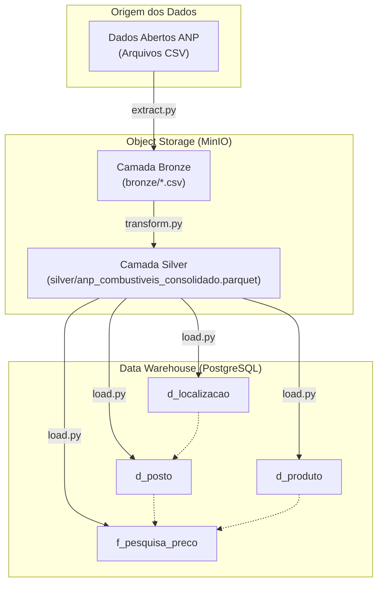

# ANP Fuel Data Pipeline (Modern Data Stack On-Premises)

Pipeline end-to-end de Engenharia de Dados para extração, processamento, modelagem dimensional e carga de dados abertos de preços de combustíveis da **ANP (Agência Nacional do Petróleo, Gás Natural e Biocombustíveis)**.

O projeto implementa uma arquitetura medalhão **(Bronze, Silver e Gold)** utilizando armazenamento em objetos com MinIO, transformação colunar via Pandas/PyArrow e data warehouse analítico estruturado em SnowFlake no PostgreSQL, tudo orquestrado via contêineres Docker.

## Arquitetura da Solução



## Estrutura das Camadas de Dados
**Bronze (Raw Data)**: Ingestão bruta dos arquivos CSV coletados diretamente da base de dados abertos da ANP, mantendo os dados fiéis à origem.

**Silver (Standardized Data)**: Limpeza e consolidação em lote. Padronização de esquemas de colunas (removendo caracteres especiais e inconsistências históricas), remoção de registros nulos críticos em valor_venda, preenchimento de campos de endereço, tipagem estrita de datas e valores numéricos, persistidos em formato Apache Parquet com compressão Snappy.

**Gold (Analytical / DW)**: Modelagem dimensional baseada na metodologia Kimball (SnowFlake Schema), gerando chaves artificiais (surrogate keys) para as dimensões e persistindo os dados no PostgreSQL.

## Modelo de Dados (SnowFlake Schema)
- **d_posto**: Cadastro descritivo e localização do posto revendedor (cnpj_revenda, revenda, bandeira, id_localizacao).

- **d_produto**: Catálogo de combustíveis pesquisados e suas respectivas métricas (produto, unidade_medida).

- **d_localizacao**: Hierarquia geográfica consolidada (municipio, estado_sigla, regiao_sigla).

- **f_pesquisa_preco**: Tabela de fatos central contendo as métricas de preço coletadas (valor_venda), chaves de dimensão (id_posto, id_produto, id_localizacao), data da coleta e carimbo de auditoria (data_processamento).

## Tecnologias Utilizadas
- **Linguagem & Bibliotecas**: Python, Pandas, PyArrow, SQLAlchemy, python-dotenv, Minio SDK.

- **Storage & Banco de Dados**: MinIO (Object Storage S3-compatible), PostgreSQL.

- **Infraestrutura**: Docker.

- **Controle de Versão**: Gitflow e Conventional Commits.
# Estrutura do Repositório
```text
projeto-anp-eng/
├── .env.example
├── docker-compose.yml
├── requirements.txt
├── main.py
├── sql/
│   └── create_table.sql
└── src/
    ├── __init__.py
    ├── extract.py
    ├── transform.py
    └── load.py
```

## Como Executar o Projeto Localmente

### 1. Pré-requisitos
* **Docker** instalado
* **Python 3.10+** (ou ambiente virtual configurado)

### 2. Configurar Variáveis de Ambiente
Crie o arquivo `.env` a partir do modelo de exemplo:

```bash
cp .env.example .env
```

### 3. Iniciar Serviços de Infraestrutura (MinIO & PostgreSQL)
Suba os contêineres em segundo plano:

```bash
docker-compose up -d
```

### 4. Configurar o Ambiente Python
Crie e ative a virtualenv, em seguida instale as dependências:

```bash
python -m venv .venv
source .venv/bin/activate  # Linux/WSL/macOS
# .venv\Scripts\activate   # Windows PowerShell

pip install -r requirements.txt
```

### 5. Executar a Pipeline End-to-End
Rode o script principal para executar todo o fluxo Bronze ➔ Silver ➔ Gold:

```bash
python main.py
```
